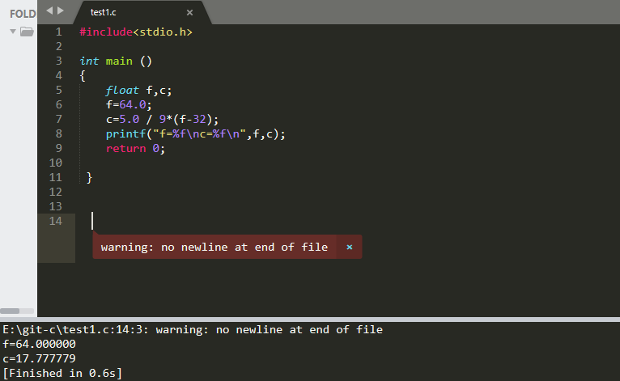

## 例1：有人用温度计测量出用华氏发表示温度（如64°F），现在要求把它  转     换为以摄氏法表示的温度（如17.8°C）
### 解题思路：这个问题的算法很简单，关键在于找到二者之间的转化公式
c=5/9（f-32）

```
#include<stdio.h>

int main ()
{
    float f,c;
    f=64.0;
    c=5.0 / 9*(f-32);
    printf("f=%f\nc=%f\n",f,c);
    return 0;
    
 }
```

最后呈现出来的效果是这样的
