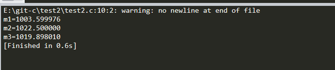

## 计算存款利息。有1000元，想存一年，有三种方法可选择：（1）活期，年利率为r1,；（2）一年期定期，年利率为r2；（3）存两次半年定期，年利率为r3。请分别计算出一年后按3种方法所得到的本息和


### 解题思路：这个问题的算法很简单，关键在于找到公式。若存款额为p0，则：活期存款一年后的本息和为m1=p0（1+r1）。一年定期存款后，本息和为m2=p0（1+r2）。两次半年定期存款，一年后本息和m3=p0（1+r3/2)1+r3/2）

```c

#include<stdio.h>
int main()
{
    float m0=1000,r1=0.0036,r2=0.0225,r3=0.0198,m1,m2,m3;
    m1=m0*(1+r1);
    m2=m0*(1+r2);
    m3=m0*(1+r3/2)*(1+r3/2);
    printf("m1=%f\nm2=%f\nm3=%f\n", m1,m2,m3);
    return 0;
}


```


最后结果如图