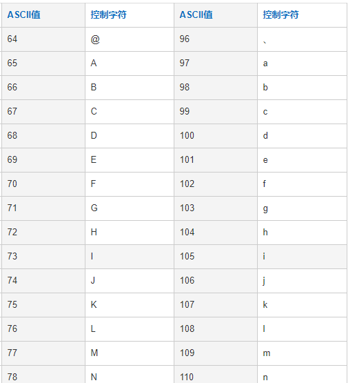
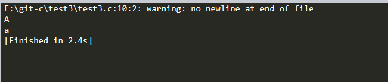

## 例3：给定一个大写字母，要求用小写输出
### 解题思路：字符数据以ASCII码存储在内存的，形式与整数的存储形式相同。所以字符型数据和其他算术型数据之间可以互相赋值和运算

#### ASCII码如图所示：a的ASCII值比A的ASCII值大32


```c
#include<stdio.h>
int main()
{
    char c1,c2;
    c1='A';
    c2=c1+32;
    printf("%c\n",c1 );
    printf("%c\n",c2 );
    return 0;
}
```

#### 最后结果如图所示

