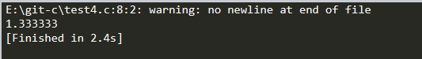

## 例4：用%f输出实数，只能得到6位小数
### 提示：1、 %f 和 %lf 默认保留六位小数，不足六位以 0 补齐，超过六位按四舍五入截断。 2、  将整数赋值给 float 变量时会变成小数。
  
      

```c
#include<stdio.h>
int main()
{
    double a=4.0;
    printf("%f\n",a/3);
    return 0;

}
```

#### 最终结果如图所示

