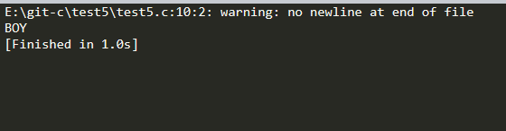

## 先后输出BOY三个字符
### 解题思路：定义3个字符变量，分别赋以初值‘B’，‘O’，‘Y’，然后用putchar函数输出3个字符变量的值
```c
#include<stdio.h>
int main()
{
    char a='B',b='O',c='Y';
    putchar(a);
     putchar(b);
      putchar(c);
       putchar('\n');
      return 0;
}
```
##### 代码演示结果
