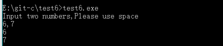

## 输入两个实数，按代数值由小到大的顺序输出这两个数
### 解题思路：为了将a和b对换，必须借助中间变量。可以这样想，将A和B两个杯子里面的水互换，用两个杯子倒来倒去是不可能实现的，必须借助第三个杯子。这就是程序中实现两变量换值的算法。
```c
#include<stdio.h>
int main()
{
    int a,b,t;
    printf("Input two numbers,Please use space\n");
    scanf("%d,%d",&a,&b);
    //getchar();
    if(a>=b)
    {
        printf("change\n");
        /*t=a;
        a=b;
        b=t;*/
        t = a + b;
        a = t-a;
        b = t-b;
    }
    printf("%d,%d\n",a,b);
    return 0;
}


```
#### 结果如图所示：

