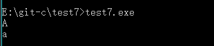

## 例7：输入一个字符，判别它是否为大写字母，如果是，将它转换成小写，如果不是，不转换。然后输出最后得到的字符。
### 解题思路：条件？表达式1：表达式2
### 如果结果为1，则表达式1的结果就是表达式的值
### 如果结果为0，则表达式2的结果就是表达式的值
```c
#include<stdio.h>
int main()
{
	char ch;
	scanf("%c",&ch);
	ch=(ch>='A'&&ch<='Z')?(ch+32):ch;
	printf("%c\n",ch);
	return 0;
}
```
#### 最终结果如图：

![](2.png

