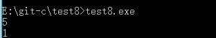
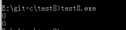
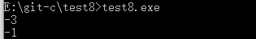

## 有一函数，当x<0时，y=-1；当x>0时，y=1；当x=0时，y=0。编写一个程序，输入一个x值，要求输出相应的y值。
### if和else if结构
```c
#include<stdio.h>
int main()
{
    int x,y;
    scanf("%d",&x);
    if(x<0)
        {y=-1;}
    else if(x>0)
    {y=1;}
    else 
        {y=0;}
    printf("%d",y );
    return 0;
}
```
#### 最终结果如图




